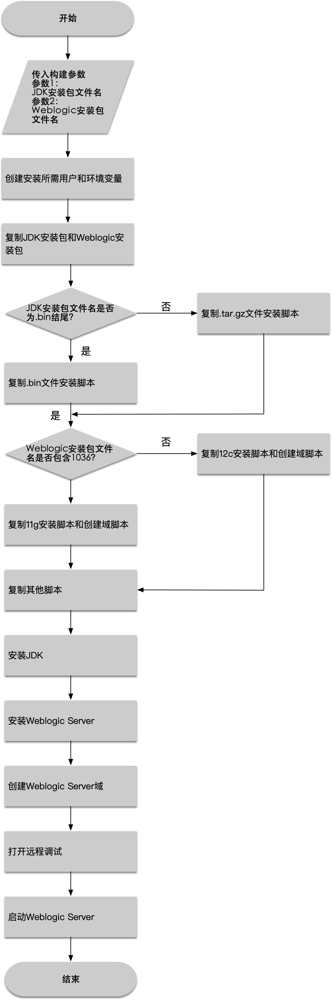
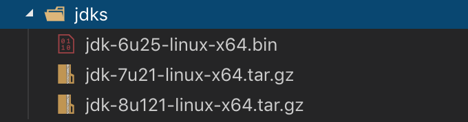
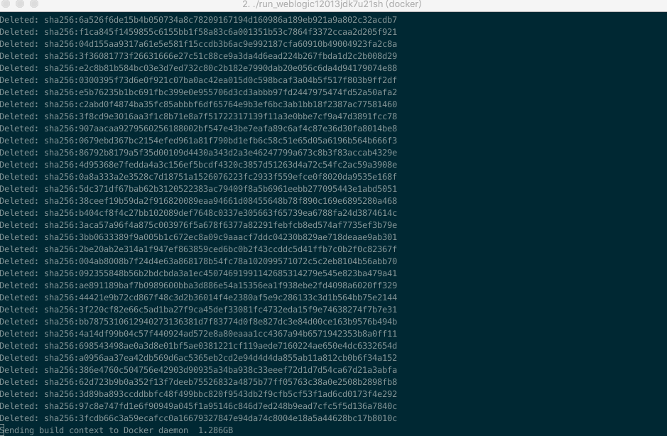

# Weblogic环境搭建工具

Weblogic环境搭建过程很繁琐，很多时候需要测试各种Weblogic版本和各种JDK版本的排列组合，因此我写了一个脚本级别的Weblogic环境搭建工具，用于安全研究时节省大家搭建环境的时间。
此环境搭建工具使用Docker和shell脚本，因此需要本机安装Docker才可以使用。经测试漏洞搭建工具可以在3分钟内构建出任意JDK版本搭配任意Weblogic版本，包含一个可远程调试的已启动的Weblogic Server域环境。

## 需求
- 自动化安装任意版本JDK
- 自动化安装任意版本Weblogic Server
- 自动化创建域
- 自动打开远程调试
- 自动启动一个Weblogic Server域

## 流程



## 使用方法：

### 下载JDK安装包和Weblogic安装包

下载相应的JDK版本和Weblogic安装包，将JDK安装包放到`jdks/`目录下，将Weblogic安装包放到`weblogics/`目录下。**此步骤必须手动操作，否则无法进行后续步骤。**




JDK安装包下载地址：https://www.oracle.com/technetwork/java/javase/archive-139210.html
Weblogic安装包下载地址：https://www.oracle.com/technetwork/middleware/weblogic/downloads/wls-for-dev-1703574.html

### 构建镜像并运行

回到根目录，执行Docker构建镜像命令：

```plain text
docker build --build-arg JDK_PKG=<YOUR-JDK-PACKAGE-FILE-NAME> --build-arg WEBLOGIC_JAR=<YOUR-WEBLOGIC-PACKAGE-FILE-NAME>  -t <DOCKER-IMAGE-NAME> .
```
镜像构建完成后，执行以下命令运行：
```plain text
docker run -d -p 7001:7001 -p 8453:8453 -p 5556:5556 --name <CONTAINER-NAME> <DOCKER-IMAGE-NAME-YOU-JUST-BUILD>
```

以Weblogic12.1.3配JDK 7u21为例，构建镜像命令如下：
```plain text
docker build --build-arg JDK_PKG=jdk-7u21-linux-x64.tar.gz --build-arg WEBLOGIC_JAR=fmw_12.1.3.0.0_wls.jar  -t weblogic12013jdk7u21 .
```
镜像构建完成后，执行以下命令运行：
```plain text
docker run -d -p 7001:7001 -p 8453:8453 -p 5556:5556 --name weblogic12013jdk7u21 weblogic12013jdk7u21
```

运行后可访问`http://localhost:7001/console/login/LoginForm.jsp`登录到Weblogic Server管理控制台，默认用户名为`weblogic`,默认密码为`qaxateam01`

### 远程调试

如需远程调试，需使用`docker cp`将远程调试需要的目录从已运行的容器复制到本机。

也可以使用`run_weblogic1036jdk6u25.sh`、`run_weblogic12013jdk7u21sh`、`run_weblogic12021jdk8u121.sh`这三个脚本进行快速环境搭建并复制远程调试需要用到的目录。执行前请赋予它们相应的可执行权限。

### 示例
以JDK 7u21配合Weblogic 12.1.3为例，自动搭建效果如下：


## 兼容性测试
已测试了如下环境搭配的兼容性：

- 测试系统：macOS Mojave 10.14.5
- Docker版本：Docker 18.09.2

- [x] Weblogic 10.3.6 With JDK 6u25
- [x] Weblogic 10.3.6 With JDK 7u21
- [x] Weblogic 10.3.6 With JDK 8u121
- [x] Weblogic 12.1.3 With JDK 7u21
- [x] Weblogic 12.1.3 With JDK 8u121
- [x] Weblogic 12.2.1 With JDK 8u121

## 已知问题

- 由于时间关系，我没有对更多Weblogic版本和更多的JDK版本搭配做测试，请自行测试
- 请时刻关注输出内容，如出现异常请自行修改对应脚本

欢迎大家一起为此自动化环境搭建工具贡献力量。
